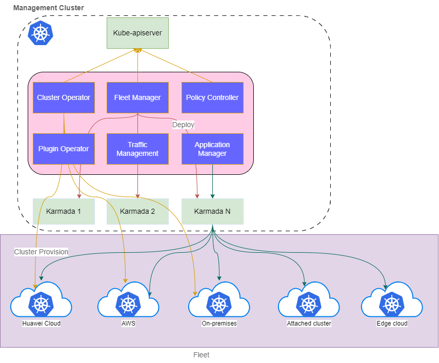

# Kurator

## Overview

Kurator is an open source distributed cloud native platform that helps users to build their own distributed cloud native infrastructure and facilitates enterprise digital transformation.

Kurator integrates popular cloud native software stacks including [Karmada](https://github.com/karmada-io/karmada), [KubeEdge](https://github.com/kubeedge/kubeedge), [Volcano](https://github.com/volcano-sh/volcano), [Kubernetes](https://github.com/kubernetes/kubernetes), [Istio](https://github.com/istio/istio), [Prometheus](https://github.com/prometheus/prometheus), etc.
It provides powerful capabilities to multi-cloud and multi-cluster, including:

- Multi-cloud, Edge-cloud, Edge-edge Synergy
- Unified Resource Orchestration
- Unified Scheduling
- Unified Traffic Management
- Unified Telemetry

## Advantages

- Infrastructure-as-Code: declarative way of infrastructure(cluster, node, vpc, etc) management on cloud, edge or on premises.
- Out of box: one button to install cloud native software stacks
- Unified management of clusters with fleet

## Architecture

    

## Documentation

Please visit [kurator website](https://kurator.dev/docs/) for our documentation.

## Contact

If you have any question, feel free to reach out to us in the following ways:

- [mailing group](https://groups.google.com/g/kuator-dev)
- [slack](https://join.slack.com/t/kurator-hq/shared_invite/zt-1sowqzfnl-Vu1AhxgAjSr1XnaFoogq0A)

## Contributing

If you're interested in being a contributor and want to get involved in
developing the Kurator code, please see [CONTRIBUTING](CONTRIBUTING.md) for
details on submitting patches and the contribution workflow.

## License

Kurator is under the Apache 2.0 license. See the [LICENSE](LICENSE) file for details.
