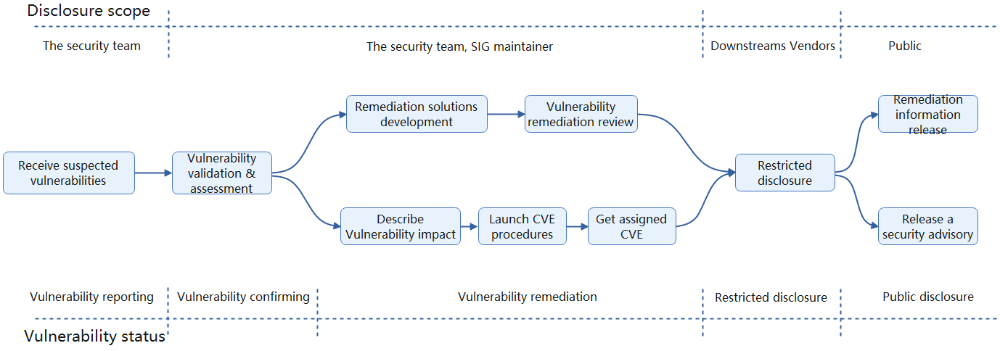
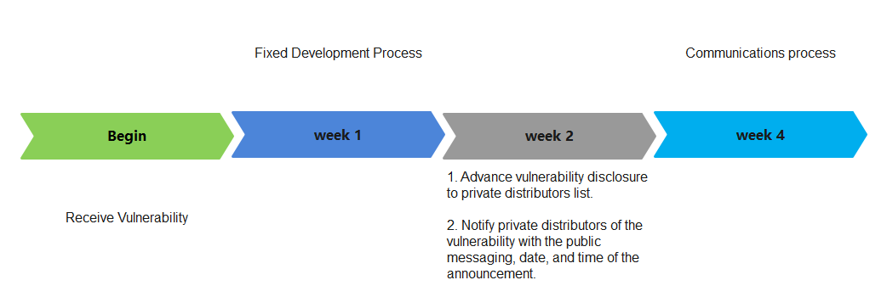

# Security Release Process

Kurator has always attached great importance to vulnerability management in development and maintenance. The Kurator community has adopted this security disclosures and response policy to ensure we responsibly handle critical issues.

<!-- toc -->

- [Security Release Process](#security-release-process)
  - [The Security Team](#the-security-team)
    - [The Security Team Membership](#the-security-team-membership)
      - [Joining](#joining)
      - [Stepping Down](#stepping-down)
      - [Responsibilities](#responsibilities)
        - [Associate](#associate)
  - [Process a undisclosed vulnerability](#process-a-undisclosed-vulnerability)
  - [Process a publicly disclosed vulnerability](#process-a-publicly-disclosed-vulnerability)
  - [Vulnerability handling process](#vulnerability-handling-process)
  - [Patch, Release, and Public Communication](#patch-release-and-public-communication)
    - [Fix Development Process](#fix-development-process)
    - [Fix Disclosure Process](#fix-disclosure-process)
  - [Private Distributors List](#private-distributors-list)

## The Security Team

Security is of the highest importance and security vulnerabilities should be handled quickly and sometimes privately.

The Security Team is responsible for organizing the entire response including internal communication and external disclosure but will need help from relevant developers and release managers to successfully run this process. The Security Team membership is managed [here](security-groups.md).

### The Security Team Membership

#### Joining

New potential members to the security team will first fill a minimum of a 3 month rotation in the [Associate](#Associate) role. These individuals will be nominated by individuals on maintainers.

#### Stepping Down

Members may step down at anytime.

#### Responsibilities

- Members should remain active and responsive.
- Longer leaves of absence should be discussed on a case-by-case basis, and may include an associate temporarily onboarding.
- Members of a role should remove any other members that have not communicated a leave of absence and either cannot be reached for more than 2 months or are not fulfilling their documented responsibilities for more than 2 months. This may be done through a super-majority vote of members.

##### Associate

A role for those wishing to join the security team.

Their rotation will involve the following:

- lead disclosures that are publicly disclosed or explicitly designated as low sensitivity (often done because of reporter request, a low CVSS score, or design issue that requires long-term refactoring).
- assisting in process improvements, bug bounty administration, audits, or other non-disclosure activities

## Process a undisclosed vulnerability

The Kurator Community asks that all suspected vulnerabilities be privately and responsibly disclosed via a recommended way available at [here](report-a-vulnerability.md).

If the vulnerability is accepted, its remediation priority, and develop remediations (including mitigations, patches/versions, and other risk mitigations) will be determined follow the procedure at [here](#vulnerability-handling-process).

## Process a publicly disclosed vulnerability

If you know of a publicly disclosed security vulnerability please IMMEDIATELY email [kurator-security@googlegroups.com](mailto:kurator-security@googlegroups.com) to inform the Security Team about the vulnerability so they may start the patch, release, and communication process.

If possible the Security Team will ask the person making the public report if the issue can be handled via a private disclosure process. If the reporter denies the request, the Security Team will move swiftly with the fix and release process.

## Vulnerability handling process

The following flowchart shows the vulnerability handling process. We will strictly handle the reporting vulnerability according to this procedure.

## Patch, Release, and Public Communication

All of the timelines below are suggestions and assume a Private Disclosure.

The Security Team drives the schedule using their best judgment based on severity, development time, and release manager feedback. If the fix relies on another upstream project's disclosure timeline, that will  adjust the process as well. We will work with the upstream project to fit their timeline and best protect
our users.

The following is a timeline of a vulnerability process.

### Fix Development Process

This part should be completed within the 1-7 days of Disclosure.

After receiving any suspected vulnerability, the Security Team will discuss the issue with the reporter(s) and Kurator's security advisors to analyze/validate the vulnerability, assess its severity based on its actual impact on Kurator.

If the vulnerability is accepted, its remediation priority, and develop remediations (including mitigations, patches/versions, and other risk mitigations) will be determined.

The Security Team will launch a CVE procedures to get a CVSS score and CVE ID. The CVSS v3 adopted by the Kurator community assesses the impact of a vulnerability.

If the CVSS score is under ~4.0 ([a low severity score](https://www.first.org/cvss/specification-document#i5)) or the assessed risk is low the Security Team can decide to slow the release process down in the face of holidays, developer bandwidth, etc.

If the CVSS score is under ~7.0 (a medium severity score), the Security Team may choose to carry out the fix semi-publicly. This means that PRs are made directly in the public kurator-dev/kurator repo, while restricting discussion of the security aspects to private channels. The Security Team will make the determination whether there would be user harm in handling the fix publicly that outweighs the benefits of open engagement with the community.

Critical and High severity vulnerability fixes will typically receive an out-of-band release. Medium and Low severity vulnerability fixes will be released as part of the next Kurator [patch release](https://github.com/kurator-dev/kurator/releases).

Note: CVSS is convenient but imperfect. Ultimately, the Security Team has discretion on classifying the severity of a vulnerability.

### Fix Disclosure Process

With the Fix Development underway, the Security Team needs to come up with an overall communication plan for the wider community. This Disclosure process should begin after the Security Team has developed a Fix or mitigation so that a realistic timeline can be communicated to users. Emergency releases for critical and high severity issues or fixes for issues already made public may affect the below timelines for how quickly or far in advance notifications will occur.

**Advance Vulnerability Disclosure to Private Distributors List** (Completed within 1-4 weeks prior to public disclosure):

- The [Private Distributors List](#private-distributors-list) will be given advance notification of any vulnerability that is assigned a CVE, at least 7 days before the planned public disclosure date. The notification will include all information that can be reasonably provided at the time of the notification. This may include patches or links to PRs, proofs of concept or instructions to reproduce the vulnerability, known mitigations, and timelines for public disclosure. Distributors should read about the [Private Distributors List](#private-distributors-list) to find out the requirements for being added to this list.
- **What if a vendor breaks embargo?** The Security Team will assess the damage and will make the call to release earlier or continue with the plan. When in doubt push forward and go public ASAP.

**Fix Release Day**
Release process:

- The Security Team will cherry-pick the patches onto the master branch and all relevant release branches.
- The Release Managers will merge these PRs as quickly as possible. Changes shouldn't be made to the commits at this point, to prevent potential conflicts with the patches sent to distributors, and conflicts as the fix is cherry-picked around branches.
- The Release Managers will ensure all the binaries are built, publicly available, and functional.

Communications process:

- The [Private Distributors List](#private-distributors-list) will be notified at least 24 hours in advance of a pending release containing security vulnerability fixes with the public messaging, date, and time of the announcement.
- The Security Team will announce the new releases, the CVE number, severity, and impact, and the
  location of the binaries to get wide distribution and user action. As much as possible this
  announcement should be actionable, and include any mitigating steps users can take prior to
  upgrading to a fixed version. The announcement will be sent via the following channels:
  - Tracking issue opened in [kurator](https://github.com/kurator-dev/kurator/issues) and prefixed with the associated CVE ID (if applicable)
  - [Patch release](https://github.com/kurator-dev/kurator/releases), will have the fix details included in the patch release notes. Any public announcement sent for these fixes will link to the release notes.

## Private Distributors List

This list is used to provide actionable information to multiple distribution vendors at once.

See the [private distributor list doc](private-distributors-list.md) for more information.
