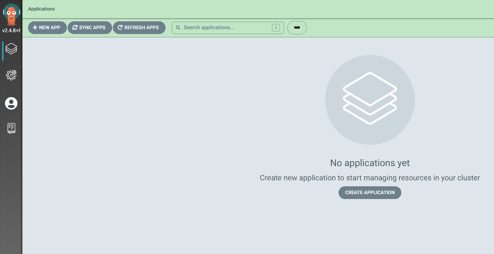
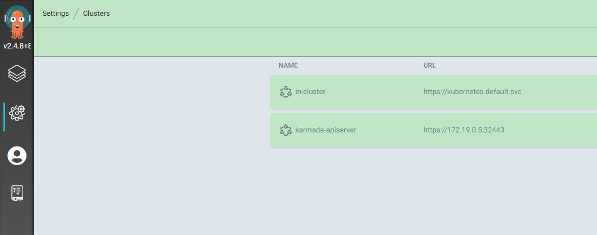
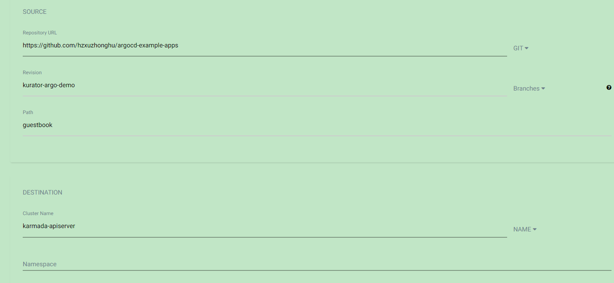
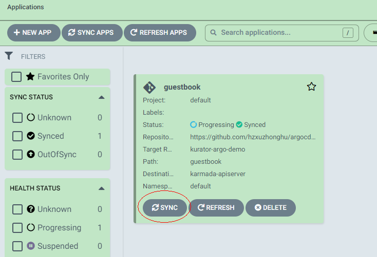

### What is ArgoCD

[ArgoCD](https://argoproj.github.io/cd/) is a declarative, GitOps continuous delivery tool for Kubernetes.

1. Application definitions, configurations, and environments should be declarative and version controlled.
2. Application deployment and lifecycle management should be automated, auditable, and easy to understand.


In this task, we will first show you how to install ArgoCD with kurator. And then, it will give a small example
to show you how to deploy application with ArgoCD pull mode. For more details about GitOps pull mode, refer to [gitops.tech](https://www.gitops.tech/#pull-based-deployments)

### Prerequisites

This task requires you have installed karmada and have joined at least one member cluster.
Otherwise, setup karmada environment following [Install Karmada with Kurator](./karmada.md).

### Install ArgoCD

Kurator provides a very simple command to install ArgoCD and add karmada-apiserver as the destination to deploy application to.
    
- `--kubeconfig` specifies the cluster where to deploy argoCD itself, it is the kurator host cluster that hold argoCD.
- `--cluster-kubeconfig` and `--cluster-context` specifies the cluster which will be registered to argoCD to deploy application to. 

```bash
kurator install argocd --kubeconfig=/root/.kube/kurator-host.config --cluster-kubeconfig=/etc/karmada/karmada-apiserver.config --cluster-context=karmada-apiserver
```

### Verify clusters registered to argoCD

Suppose you are running the installation in an external VM, you need to expose argocd server. 

```bash
kubectl port-forward --address 0.0.0.0 svc/argocd-server -n argocd 30080:80
```

And then access ArgoCD server `https://<your vm address>:30080` from your browser.


It requires login, there is a default user `admin` can be used and the password can be fetched by

```  bash
kubectl -n argocd get secret argocd-initial-admin-secret -o jsonpath="{.data.password}" | base64 -d; echo
```


After login successfully, you can see this page, and there is no application now.




And then click settings on the left,  you can see there is a cluster named `karmada-apiserver`, which is registered during install. `in-cluster`is automatically registered, we do not use it in this example.




### Deploy application to karmada-spiserver

### Prepare application

We have prepared a [app repo](https://github.com/hzxuzhonghu/argocd-example-apps/tree/kurator-argo-demo) by forking  [argocd-example-apps](https://github.com/argoproj/argocd-example-apps), you have to create [PropagationPolicy](https://pkg.go.dev/github.com/karmada-io/karmada@v1.2.1/pkg/apis/policy/v1alpha1#PropagationPolicy) for your own application accordingly.


#### Create App via CLI

Create the example guestbook application with the following command:

```bash
argocd app create guestbook --repo https://github.com/hzxuzhonghu/argocd-example-apps --revision=kurator-argo-demo --path guestbook --dest-name=karmada-apiserver --dest-namespace=default
```

#### Create App via UI

After logging in, click the **+ New App** button as shown below:

Give your app the name `guestbook`, use the project `default`, and leave the sync policy as `Manual`:


Connect the [argocd-example-apps](https://github.com/hzxuzhonghu/argocd-example-apps.git) repo to Argo CD by setting repository url to the github repo url, set revision as `kurator-argo-demo`, and set the path to `guestbook`, set destination cluster to `karmada-apiserver`



After filling out the information above, click **Create** at the top of the UI to create the `guestbook` application.


#### Sync App via CLI

You can sync guest app via CLI with the below command:


```bash
$ argocd app sync guestbook
TIMESTAMP                  GROUP                    KIND          NAMESPACE                  NAME    STATUS    HEALTH        HOOK  MESSAGE
2022-08-12T14:38:26+08:00   apps              Deployment            default          guestbook-ui  OutOfSync  Missing              
2022-08-12T14:38:26+08:00  policy.karmada.io  PropagationPolicy     default             guestbook  OutOfSync  Missing              
2022-08-12T14:38:26+08:00                        Service            default          guestbook-ui  OutOfSync  Missing              
2022-08-12T14:38:27+08:00            Service     default          guestbook-ui    Synced  Healthy              
2022-08-12T14:38:27+08:00   apps  Deployment     default          guestbook-ui    Synced  Progressing              
2022-08-12T14:38:27+08:00                        Service            default          guestbook-ui    Synced   Healthy                  service/guestbook-ui created
2022-08-12T14:38:27+08:00   apps              Deployment            default          guestbook-ui    Synced   Progressing              deployment.apps/guestbook-ui created
2022-08-12T14:38:27+08:00  policy.karmada.io  PropagationPolicy     default             guestbook  OutOfSync  Missing                  propagationpolicy.policy.karmada.io/guestbook created
2022-08-12T14:38:27+08:00  policy.karmada.io  PropagationPolicy     default             guestbook    Synced  Missing              propagationpolicy.policy.karmada.io/guestbook created

Name:               guestbook
Project:            default
Server:             karmada-apiserver
Namespace:          default
URL:                https://172.19.255.155:80/applications/guestbook
Repo:               https://github.com/hzxuzhonghu/argocd-example-apps
Target:             kurator-argo-demo
Path:               guestbook
SyncWindow:         Sync Allowed
Sync Policy:        <none>
Sync Status:        Synced to kurator-argo-demo (559fc7e)
Health Status:      Progressing

Operation:          Sync
Sync Revision:      559fc7ef61fcce29df00a5c220e5281587023dc0
Phase:              Succeeded
Start:              2022-08-12 14:38:26 +0800 CST
Finished:           2022-08-12 14:38:27 +0800 CST
Duration:           1s
Message:            successfully synced (all tasks run)

GROUP              KIND               NAMESPACE  NAME          STATUS  HEALTH       HOOK  MESSAGE
                   Service            default    guestbook-ui  Synced  Healthy            service/guestbook-ui created
apps               Deployment         default    guestbook-ui  Synced  Progressing        deployment.apps/guestbook-ui created
policy.karmada.io  PropagationPolicy  default    guestbook     Synced                     propagationpolicy.policy.karmada.io/guestbook created

```


#### Sync App via UI


You can click the **Sync** button to manually sync the guestbook App, which is equal to CLI.



 

### Verify app deployed to member clusters

In the UI, click the **guestbook**, you can see the App sync ok, and with resourcebinding `guestbook-ui-service`and `guestbook-ui-deployment`created by karmada.


If you further click the `guestbook-ui-deployment`, you will see the below status if succeed. It indicates one instance is deployed  to `member1`cluster and one is deployed to `member2`cluster.


