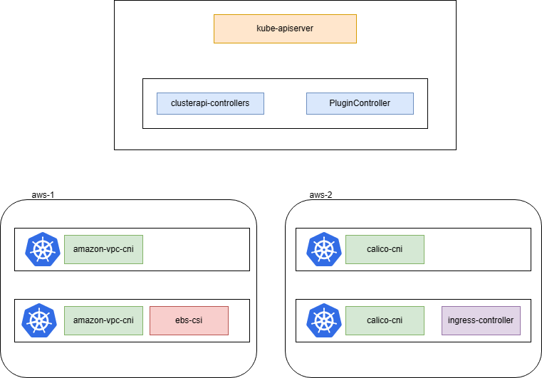

# Cluster Operator on AWS

## Summary

Cluster API is a Kubernetes sub-project focused on providing declarative APIs and tooling to simplify provisioning, upgrading, and operating multiple Kubernetes clusters.

Cluster API unable to manage cluster infrastructure such as CNI, CSI, Ingress Controller.

This proposal introduces a new component Cluster Operator to Kurator and enables Kurator to get your cluster up and running.

## Motivation

<!--
This section is for explicitly listing the motivation, goals, and non-goals of
this KEP.  Describe why the change is important and the benefits to users.
-->

### Goals

1. Provisioning, upgrading, and operating multiple Kubernetes clusters base on Cluster API.
1. Least privilege base on IRSA.
1. Easy to manage cluster infrastructure on AWS.

### Non-Goals

1. Manage AWS credentials
1. Manage AWS IAM role and policy

## Proposal

<!--
This is where we get down to the specifics of what the proposal actually is.
This should have enough detail that reviewers can understand exactly what
you're proposing, but should not include things like API designs or
implementation. What is the desired outcome and how do we measure success?.
The "Design Details" section below is for the real
nitty-gritty.
-->

### User Stories (Optional)

<!--
Detail the things that people will be able to do if this KEP is implemented.
Include as much detail as possible so that people can understand the "how" of
the system. The goal here is to make this feel real for users without getting
bogged down.
-->

#### Story 1

For a operator who want to provision a kubernetes cluster on AWS with [Amazon VPC CNI](https://github.com/aws/amazon-vpc-cni-k8s).


#### Story 2

For a operator who want to provision a kubernetes cluster on AWS with [Amazon EBS CSI](https://github.com/kubernetes-sigs/aws-ebs-csi-driver).


#### Story 3

For a operator who want to provision a kubernetes cluster on AWS with [AWS Load Balancer Controller](https://kubernetes-sigs.github.io/aws-load-balancer-controller).


### Notes/Constraints/Caveats (Optional)

<!--
What are the caveats to the proposal?
What are some important details that didn't come across above?
Go in to as much detail as necessary here.
This might be a good place to talk about core concepts and how they relate.
-->

### Risks and Mitigations

1. Need to grant `s3` access permission to master node to support [IRSA](https://docs.aws.amazon.com/eks/latest/userguide/iam-roles-for-service-accounts.html).
2. Amazon VPC CNI need bypass all ports in security group.

<!--
What are the risks of this proposal, and how do we mitigate? 

How will security be reviewed, and by whom?

How will UX be reviewed, and by whom?

Consider including folks who also work outside the SIG or subproject.
-->

## Design Details

### Architecture



A new CRD `ClusterPlugin` will be used to describe the infrastructure of kubernetes cluster.

```golang
// ClusterPluginSpec declares plugins in the cluster
type ClusterPluginSpec struct {
	// ClusterName is the name of the Cluster this object belongs to.
	ClusterName string `json:"clusterName"`
	// Networking decalres the networking configuration of the Cluster this object belongs to.
	Networking ClusterNetworkingSpec `json:"netkworking,omitempty"`
	// Storage decalres the storage configuration of the Cluster this object belongs to.
	Storage ClusterStorageSpec `json:"stroage,omitempty"`
	// Ingress decalres the ingress configuration of the Cluster this object belongs to.
	Ingress ClusterIngressSpec `json:"ingress,omitempty"`
}

type ClusterNetworkingSpec struct {
	AmazonVPC *AmazonVPCNetworkingSpec `json:"amazonVPC,omitempty"`
	Calico    *CalicoNetworkingSpec    `json:"calico,omitempty"`
}


```

### How to install CNI for target cluster?

`PluginController` should watch `KubeadmControlPlane`, when `KubeadmControlPlane` is initialized, `PluginController` start to install CNI on target cluster.

1. Check IAM policy and role, make sure the trust policy is attached to the role.
2. Apply CNI driver to cluster, wait `KubeadmControlPlane` ready.
3. Update security group when using `Amazon VPC CNI`.

### How to install CSI for target cluster?

`PluginController` should watch `KubeadmControlPlane`, when `KubeadmControlPlane` is ready, `PluginController` start to install CSI on target cluster.

1. Check IAM policy and role, make sure the trust policy is attached to the role.
2. Apply CSI driver to cluster, wait all components running ready.

### How to install CSI for target cluster?

`PluginController` should watch `KubeadmControlPlane`, when `KubeadmControlPlane` is ready, `PluginController` start to install CSI on target cluster.

1. Check IAM policy and role, make sure the trust policy is attached to the role.
2. Apply ingress controller to cluster, wait all components running ready.

### How to clean resources when deleting cluster?

A finalizer `plugin.cluter.kurator.dev` will be added to `Cluster`. `PluginController` will purge all related resources when deleting cluster.

### Which plugin will be supported on AWS?

- Networking
  - [AmazonVPC](https://github.com/aws/amazon-vpc-cni-k8s)
  - [Calico](https://github.com/projectcalico/calico)
- Stroage
  - [EBS driver](https://github.com/kubernetes-sigs/aws-ebs-csi-driver)
  - [EFS driver](https://github.com/kubernetes-sigs/aws-efs-csi-driver)
- Ingress
  - [AWS load balance controller](https://kubernetes-sigs.github.io/aws-load-balancer-controller)

### High Availability

### Integration
### Test Plan

<!--
**Note:** *Not required until targeted at a release.*

Consider the following in developing a test plan for this enhancement:
- Will there be e2e and integration tests, in addition to unit tests?
- How will it be tested in isolation vs with other components?

No need to outline all the test cases, just the general strategy. Anything
that would count as tricky in the implementation, and anything particularly
challenging to test, should be called out.

-->

## Alternatives

<!--
What other approaches did you consider, and why did you rule them out? These do
not need to be as detailed as the proposal, but should include enough
information to express the idea and why it was not acceptable.
-->

<!--
Note: This is a simplified version of kubernetes enhancement proposal template.
https://github.com/kubernetes/enhancements/tree/3317d4cb548c396a430d1c1ac6625226018adf6a/keps/NNNN-kep-template
-->